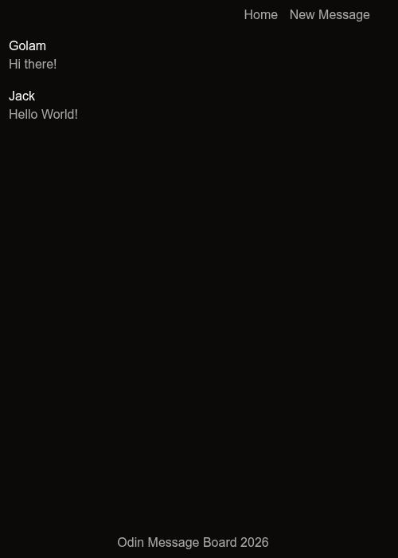
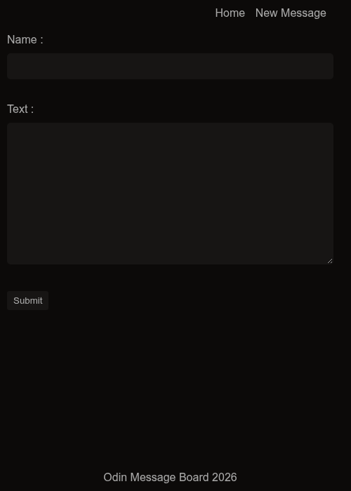
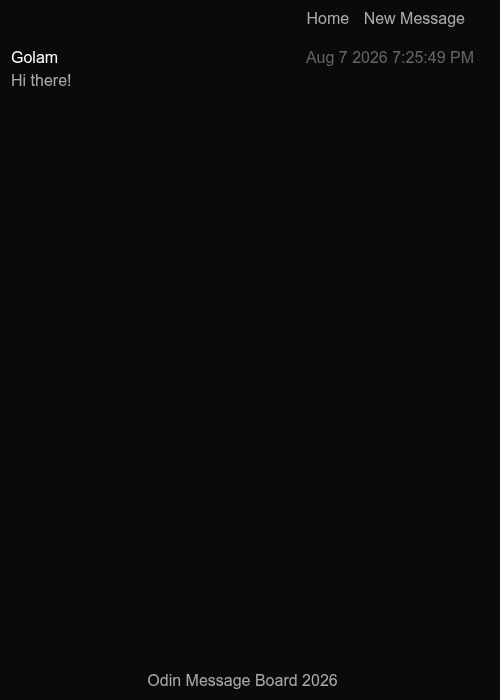

# Odin Message Board

A small Express + EJS message board. View, read, and post messages.

## Run

```bash
npm install
npm start
```

Open <http://localhost:3000>.

## Pages

| Route | Description |
| --- | --- |
| `GET /` | List all messages |
| `GET /new` | Form to create a message |
| `GET /msg/:id` | Single message detail |







## Routes

| Method | Path | Description |
| --- | --- | --- |
| GET | `/` | Renders the message list |
| GET | `/new` | Renders the new-message form |
| GET | `/msg/:id` | Renders one message by array index |
| POST | `/new` | Adds a message, then redirects to `/` |

## curl

Get the message list:

```bash
curl http://localhost:3000/
```

Get the new-message form:

```bash
curl http://localhost:3000/new
```

Get message at index `0`:

```bash
curl http://localhost:3000/msg/0
```

Create a message (form fields: `user`, `text`):

```bash
curl -X POST http://localhost:3000/new \
  -H "Content-Type: application/x-www-form-urlencoded" \
  --data "user=Golam&text=Hello from curl"
```

## Tech

- [Express](https://expressjs.com/) 5
- [EJS](https://ejs.co/) 6
- Plain CSS (in `views/styles.ejs`), no frontend framework
